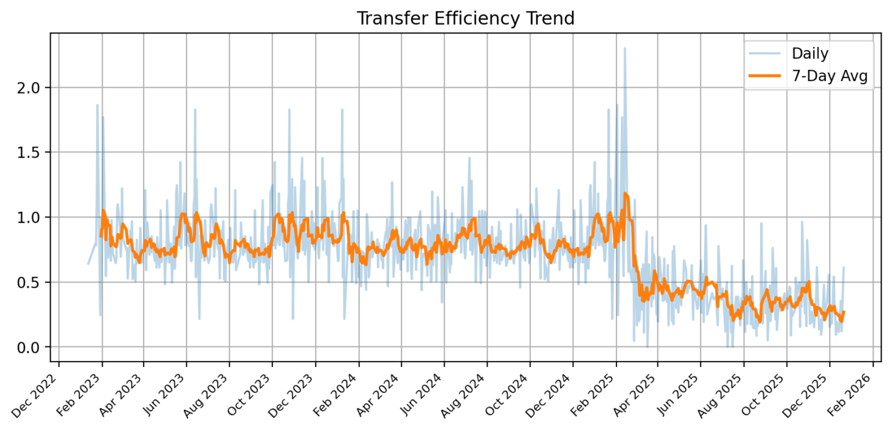

# 📊 Care Transition Efficiency & Placement Outcome Analytics Dashboard

## 🔍 Overview
This dashboard provides an end-to-end analysis of the CBP → HHS → Sponsor care pipeline,  tracking how efficiently children move through the system while identifying delays, backlog accumulation,  and breakdowns in placement outcomes that impact overall system performance.

---

## 🚀 Key Features

* 🚚 **Transition Efficiency Analysis (CBP → HHS)**
Evaluates how efficiently children are transferred into the HHS system.
* 🏠 **Discharge Effectiveness (HHS → Placement)**
Measures how effectively children are placed with sponsors after entering HHS care.
* 🔄 **System Flow (Inflow vs Outflow)**
Compares incoming vs outgoing cases to detect system imbalance.
* ⚡ **Pipeline Throughput Tracking**
Measures overall system processing capacity over time. 
* 📦 **Backlog Accumulation**
Tracks buildup of pending cases due to inefficiencies in discharge.
* 📊 **Outcome Stability Insights**
Evaluates consistency and reliability of system performance.

---
## 📂 Dataset

The dataset contains both flow and stock variables:

- Inflow: Children apprehended and entering the system  
- Intermediate stock: Children in CBP custody and HHS care  
- Outflow: Transfers to HHS and final discharge to sponsors  

This structure enables tracking of system balance, backlog formation, and throughput efficiency.

---

## 📊 Key Performance Indicators

| KPI                  | Initial | Change |
| -------------------- | ------- | ------ |
| Transfer Efficiency  | 0.27    | 0.01   |
| Discharge Efficiency | 0.004   | 0.001  |
| Throughput           | 1.34    | -0.09  |
| Backlog Rate         | -0.33   | -0.14  |
| Outcome Stability    | 0.001   |   —    |

All KPIs are normalized ratios derived from system flow variables to enable comparative trend analysis over time.

---

## 🧠 Key Insights

* The system initially operated efficiently with stable transfer and discharge rates

* A **structural breakdown emerges in early 2025**, marked by:

  * Declining discharge effectiveness
  * Reduced transfer efficiency
  * Increasing backlog accumulation

* The **HHS discharge stage acts as the primary bottleneck**, limiting overall system performance

* Throughput becomes inconsistent, and system efficiency stabilizes at a lower level

---

## 🏁 Conclusion

The analysis reveals that while the care transition pipeline initially functioned efficiently, performance deteriorates due to constraints at the discharge stage.

Limited placement capacity within HHS leads to backlog buildup, reduced throughput, and instability in outcomes.

Improving discharge processes and strengthening case management workflows is critical to restoring system efficiency and ensuring timely placement outcomes.

---

## 🖼️ Dashboard Preview

👉 Upload these images in an `images/` folder and name them exactly like this:

* `transfer_efficiency.png`
* `discharge_efficiency.png`
* `throughput_trend.png`
* `backlog_rate.png`

Then they will show like this:

---

## 🛠️ Tech Stack

* Python
* Streamlit
* Pandas
* NumPy
* Matplotlib

---

## ▶️ How to Run
1. Clone the repository
2. Install dependencies:
   pip install -r requirements.txt
3. Run the app:
   streamlit run app.py

---

## ⚠️ Note

This project is built for analytical and educational purposes to demonstrate data-driven decision-making using dashboarding tools.

---

## 👩‍💻 Author

Isha Gumber

💡 Open to suggestions and improvements.
---
